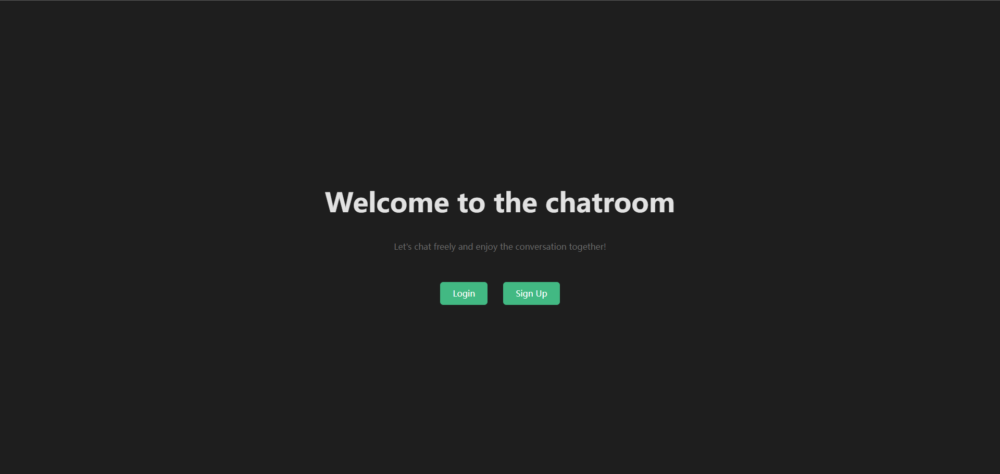
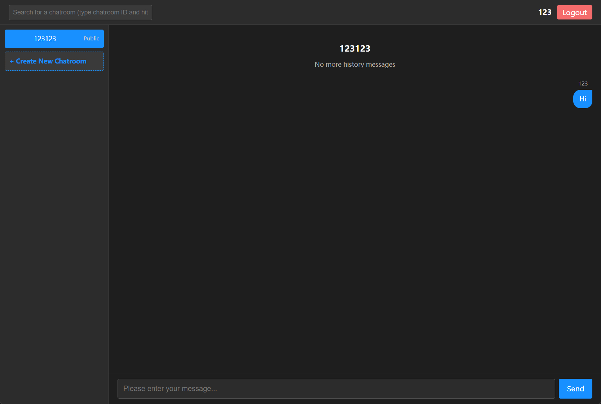

# Online Distributed Chatroom System

This is a scalable, modular, real-time chatroom system built using Go, WebSocket, Kafka, Redis, and DynamoDB. The system is designed to support high concurrency and distributed deployment using Docker and K3s.


---
## ~~Online Demo~~ 
> ⚠️ Note on Live Demo: The live deployment (AWS/K3s) is currently spun down for cost optimization. You can run the project locally using the provided scripts.

The system has already been deployed to a cloud environment.

To try it out, you can visit:

~~[http://3.133.141.191/](http://3.133.141.191/)~~

Note: The project is currently hosted on a minimal AWS Lightsail instance for cost-saving purposes. Rhe server may occasionally crash or restart.If the site is temporarily unavailable, feel free to contact me for assistance.



---

## Project Structure

| Folder / File       | Description |
|---------------------|-------------|
| `api_server/`       | Handles user registration, login, chatroom management, and token issuance via RESTful APIs. |
| `websocket_server/` | Maintains WebSocket connections, broadcasts messages via Kafka, and caches them to Redis. |
| `persist_worker/`   | Background service that periodically saves messages from Redis to DynamoDB. |
| `frontend/`         | Web-based UI for user interaction, chat window, and message rendering. |
| `kafka/`            | Kafka + Zookeeper configuration for local message queue setup. |
| `k3s-local/`        | Kubernetes YAMLs for deploying the system locally using K3s. |
| `k3s-online/`       | Kubernetes deployment configuration for online (e.g., AWS) environment. |
| `.env`, `.env.ws1`, `.env.ws2` | Environment variables for different components or replicas. |
| `docker-compose.yml`| Multi-container local setup for testing (API, WebSocket, Kafka, Redis). |
| `start-cluster.ps1`   | PowerShell script to start Kafka/Zookeeper stack locally. |
| `README.md`         | Project documentation. |

---
## Local Deployment Options

You can run the system locally in two different ways, depending on your development needs:

### Option 1: Docker Compose (Simple)

> Recommended for quick local development and testing on a single node.

#### Prerequisites

- Docker and Docker Compose installed

#### Start all services:

```bash
docker-compose up --build
```


### Prerequisites for K3s Local Deployment (via PowerShell script)

Ensure the following tools are installed before running the deployment script:

- [Docker Desktop](https://www.docker.com/products/docker-desktop)
- [kubectl](https://kubernetes.io/docs/tasks/tools/)
- [k3d](https://k3d.io/#installation)
- PowerShell 5.0+ (on Windows)

#### Quick install (Windows + Chocolatey):

```powershell
choco install docker-desktop
choco install kubernetes-cli
choco install k3d
./start-cluster.ps1
```